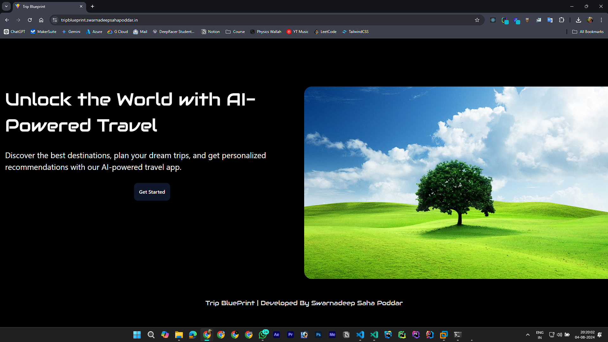
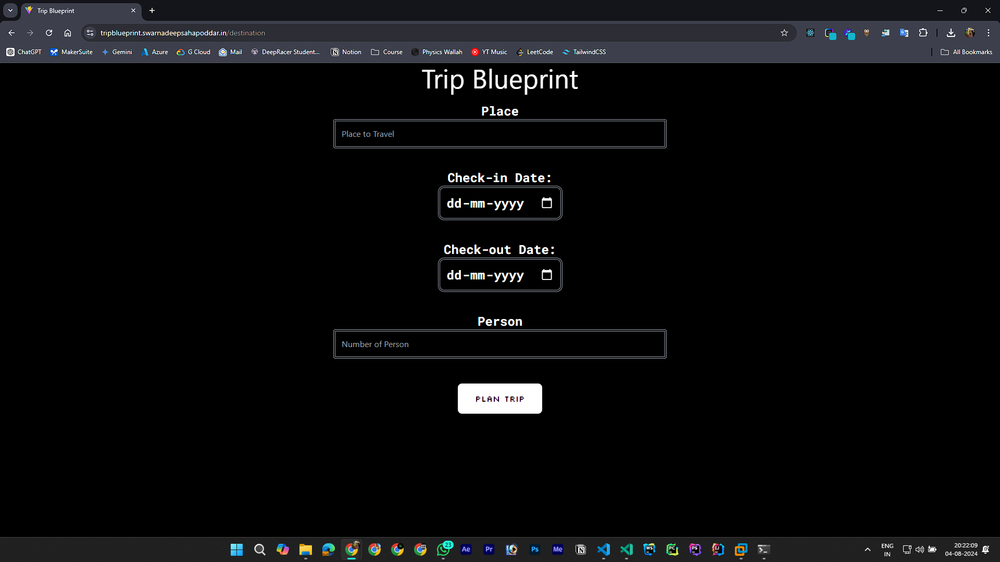
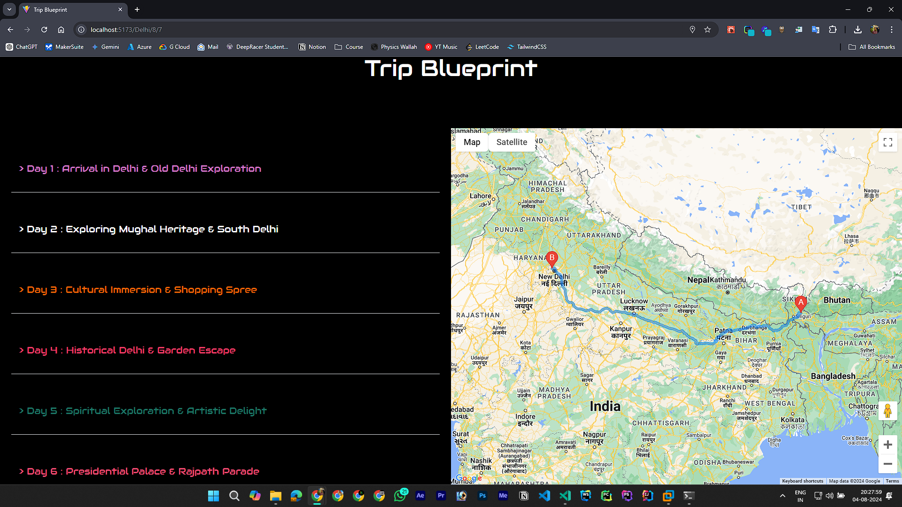
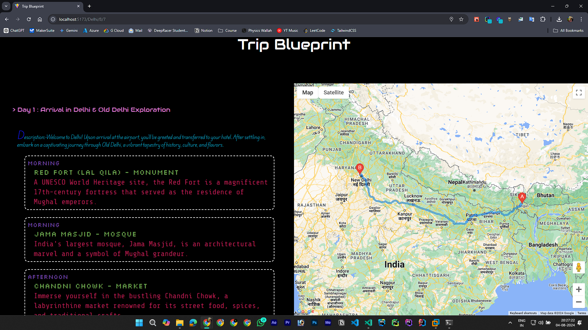

# Trip Blueprint



Welcome to Trip Blueprint, an AI-powered travel itinerary planner built with React. Trip Blueprint helps you create, customize, and visualize your travel plans seamlessly. By integrating the Gemini API and Google Maps API, it provides real-time data and interactive maps to enhance your travel planning experience. Perfect for travel enthusiasts who want a streamlined and personalized trip planning solution.

## Table of Contents

- [Features](#features)
- [Demo](#demo)
- [Installation](#installation)
- [Usage](#usage)
- [Technologies Used](#technologies-used)
- [License](#license)
- [Contact](#contact)

## Features

- **Interactive Maps:** Utilize Google Maps API to visualize routes and locations.
- **Customizable Itineraries:** Create and customize your travel plans according to your preferences.
- **Real-time Data:** Get real-time information about places using the Gemini API.
- **Responsive Design:** Fully responsive design for optimal viewing on different devices.
- **User Authentication:** Secure login and sign-up functionality (Under Progress).

## Demo

Check out the live demo of Trip Blueprint: [Trip Blueprint](https://tripblueprint.swarnadeepsahapoddar.in/)



## Installation

1. **Clone the repository:**

   ```sh
   git clone https://github.com/swarnade/trip-blueprint.git
   cd trip-blueprint
   ```

2. **Install dependencies:**

   ```sh
   npm i
   ```

3. **Add your API keys:**

   - Create a `.env` file in the root directory.
   - Add your Google Maps API key and Gemini API Using AI Studio/Vertex AI key to the `.env` file:

     ```
     REACT_APP_API_GEMINI
     REACT_APP_API_MAPS=
     ```

4. **Run the application:**

   ```sh
   npm run dev
   ```

   Your application should now be running on `http://localhost:5173`.

## Adding Vertex Ai [Optional]
1. **Go To Google Cloud Console**
2. **Enable Vertex Ai APIs**
3. **Refer To Plans.jsx**
4. **Install Vertex Ai**
```sh
       npm install @google-cloud/vertexai
```
5. **Replace This Code With Gemini Ai Studio Code Snippet**
```sh
const {VertexAI} = require('@google-cloud/vertexai');

async function generate_from_text_input(projectId = 'PROJECT_ID') {
  const vertexAI = new VertexAI({project: projectId, location: ''});

  const generativeModel = vertexAI.getGenerativeModel({
    model: 'gemini-1.5-flash-001',
  });

    const jsonnn = '```json';
    const prompt = `Make a ${props.date} Days & ${props.person} Person Tour Plan For ${props.place}  In Format "[{
      "day": "",
      "title": "",
      "description": "",
      "locations": [
        {
          "name": "",
          "type": "",
          "description": "",
          "time": ""
        }
      ],
      "notes": ""
    }] " Format Such That It Directly Compatible In Map Function Of JS And Only Directly The Json Only & And Make Sure Not To Print "${jsonnn}"`;

  const resp = await generativeModel.generateContent(prompt);
  const contentResponse = await resp.response;
  const data = eval(contentResponse);
  setOut(data);
}
```
6. **Setup Ur Cloud Credentials In .env File**

## Usage

1. **Open the application in your browser:**

   ```sh
   http://localhost:5173
   ```

2. **Navigate To Destination Page**

   - Enter The Name Of Destination.
   - Add Check-In & Check-Out Date.
   - Enter Number Of Person.

3. **Explore:**

   - Use the map to explore different locations and get real-time information.
   - Explre Day-Wise Iternary 


## Technologies Used

- **Frontend:** React, HTML, CSS, JavaScript
- **APIs:** Google Maps API, Gemini API
- **Gemini APis:** The Project Can Be Able To Utlize Both Ai Studio And Vertex Ai Version Of Vertex Apis
- **State Management:** Redux (if used)
- **Routing:** React Router (if used)

## License

This project is licensed under the MIT License - see the [LICENSE](LICENSE) file for details.

## Contact

If you have any questions or feedback, please feel free to reach out:

- **Email:** contact@swarnadeepsahapoddar.in
- **GitHub:** [swarnade](https://github.com/swarnade)